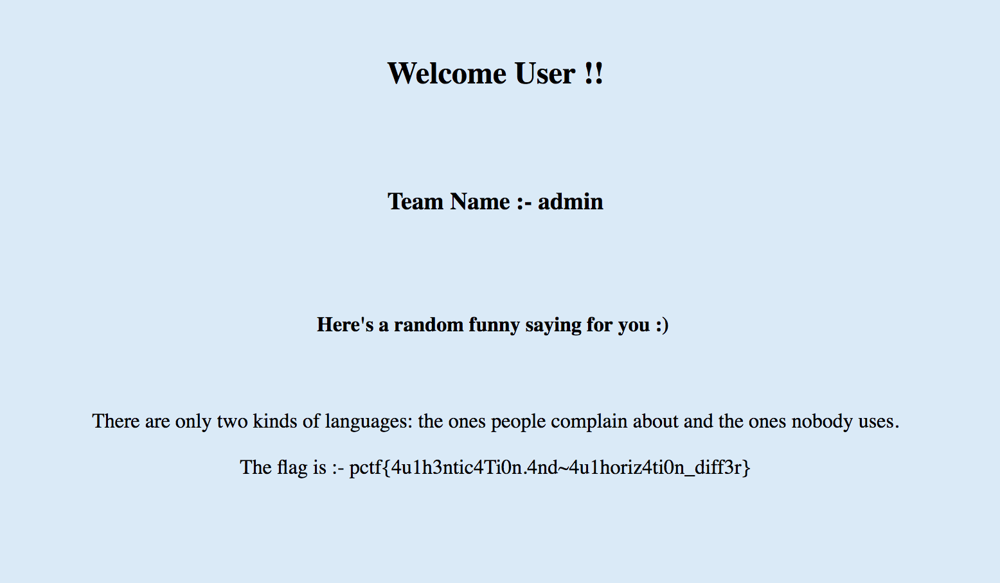

# Authenticate your way to admin
web - 150 points

## Challenge 
> Owen had created an authentication system which lets users login with their email-id or their team name. But that’s not fun is it? Logging in as the admin beats it all, so there’s your challenge.

> The portal is running at 128.199.224.175:23000

>Note: Use your Pragyan CTF credentials to login to the web portal.

> login.php  1f069e7e0b8016a80632bc76a4226b8b

> homepage.php  113dea31f23d8a774e12336cde0a4f1f

## Solution

Easy if you know PHP `._.`

In `login.php`, we realise that if type is neither `team_name` nor `email`, then the session is not killed by `die`.

Hence we can just do a post with `admin` as username and change the `id_type` to anything else.

After which, upon submitting, we see a blank screen.

Now go to `homepage.php` and we see the flag

	Welcome User !!

	Team Name :- admin

	Here's a random funny saying for you :) 

	There are only two kinds of languages: the ones people complain about and the ones nobody uses.
	The flag is :- pctf{4u1h3ntic4Ti0n.4nd~4u1horiz4ti0n_diff3r}

## Flag

	pctf{4u1h3ntic4Ti0n.4nd~4u1horiz4ti0n_diff3r}