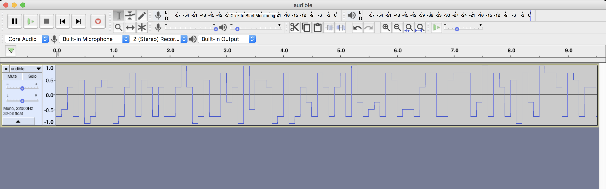
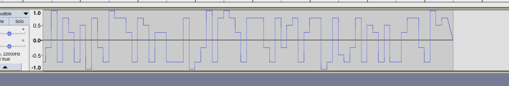

# Ears to the rescue
forensics - 150 points

## Challenge 
> Jack is trapped inside a room. All he can see and hear is a sound, his ears hear only the specific sound. He needs to escape, help him figure out what the sound means.

>  [audible.wav](audible.wav)  `2c468ff4e355d2fb85da2bd191bc88d4`

## Solution

### Extraction of data

We have a 16-bit WAV file. Open in Audacity.

It seems to be some pulse amplitude signal.

There are discrete steps every 0.1 sec.

Hence, let's extract the value at every 0.1 sec interval

	0 -24000
	1 -16200
	2 8100
	3 -24000
	4 16200
	5 -32000
	6 -24000
	7 8100
	8 16200
	9 8100
	10 -32000
	11 -24000
	12 8100
	13 24000
	14 -24000
	15 16200
	16 8100
	...

There are 144 proper pulses (excluding 145th step which appears to be like a sawtooth)

However, these are the unique values
	
	-32000
	-24000
	-16200
	-8100
	8100
	16200
	24000
	32000
	
There are 4 levels above and below the zero point. Or 8 steps in total...

---

### Solving

After [viewing a writeup for another CTF](https://www.cardinaleconcepts.com/shmooganography/), it occured to me that it is octal.

I made a translation table for the respective amplitudes

	translation = {
	    32000: '7',
	    24000: '6',
	    16200: '5',
	    8100: '4',
	    0: 0,
	    -8100: '3',
	    -16200: '2',
	    -24000: '1',
	    -32000: '0'
	}

This yielded an octal string

	124150145401461541411474015116340725540160143164146173123165122146611566613716415063176641651441116013716764166631635614660162136154151146631756

Using an [online octal-to-ascii converter](http://www.unit-conversion.info/texttools/octal/), it gives us the following. Not quite the string we are looking for, but we can see part of the flag!

	The1a	<
	N��`pctf{SuRf�v��
	3~��!N��v����r^lif��

I added spaces after every 3 octal chars to analyse it...

	124 150 145 401 461 541 411 474 015 116 340 725 540 160 143 164 146 173 123 165 122 146 611 566 613 716 415 063 176 641 651 441 116 013 716 764 166 631 635 614 660 162 136 154 151 146 631 756

We realise that some groups are larger than 7-bit ASCII (larger than `0o200`).

Hence, taking that into account in the python script... In the case that it is larger than 7 bits, we take 2 octal chars instead.

Run the script and we get the flag!

## Flag

	The flag is :- pctf{SuRf1n6_th3~4udI0_w4v3s.f0r^lif3}
