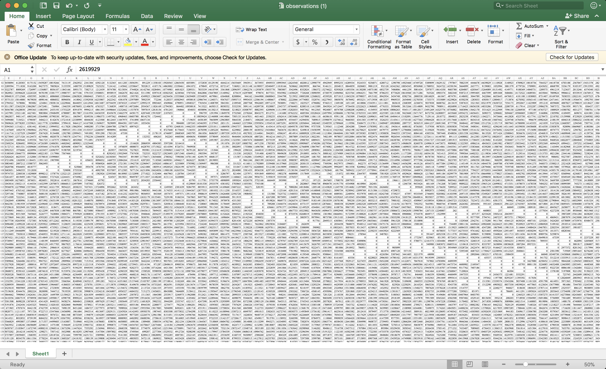
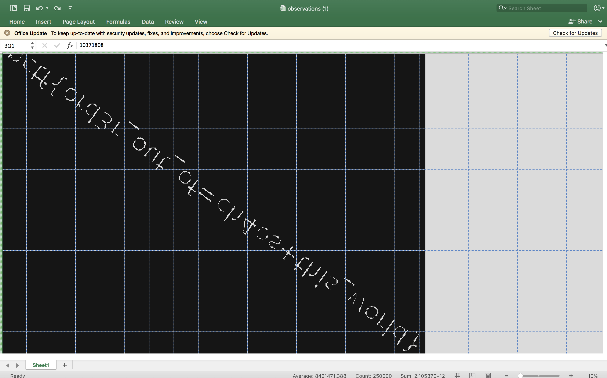

# Scientist’s research
stego - 150 points

## Challenge 
> Mary, a data scientist, specializing in CNN, has been working on a problem, she has recorded her observations in a table. Have a look at the data and deduce the flag.

> observations.xlsx  b576bc501ff53f2b4c10b9f9b213d436

## Hint
> 

## Solution

If we zoom out to 50% and we see something.

All those white cells have a value of "0". 

Let's use create a new conditional formatting: Black fill for those greater than 0.

Now we can see the flag.

Zoom out to 10% and change column width of 2 and row height of 15.

Text appears to be flipped.

Flip the screenshot and enhance it

## Flag

	pctf{ord3r_out_of=ch4os+this_world}